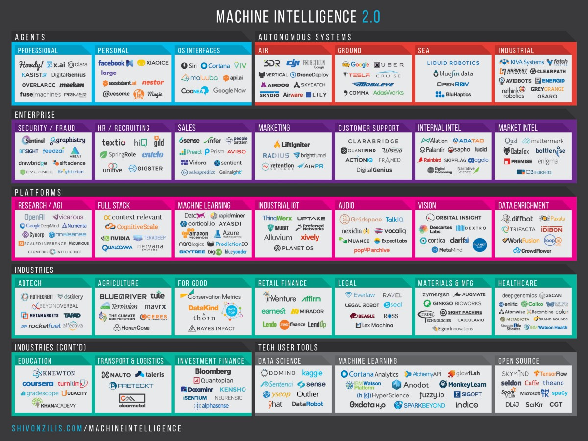
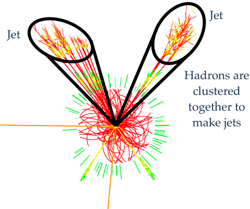
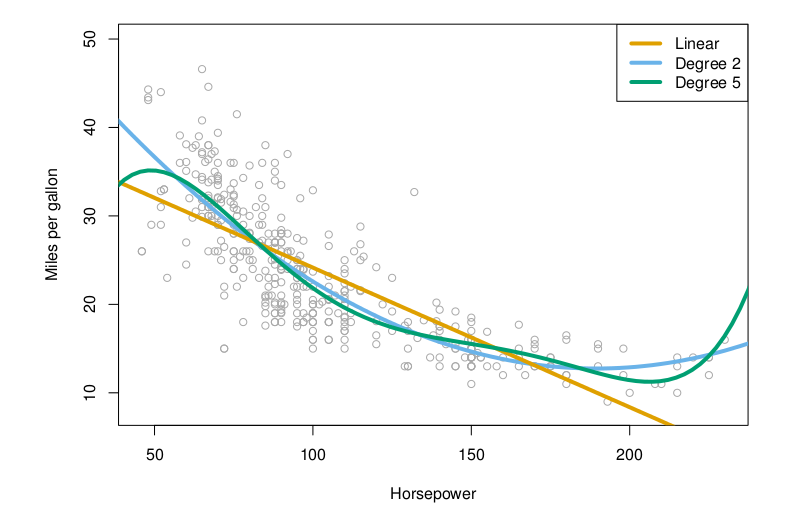
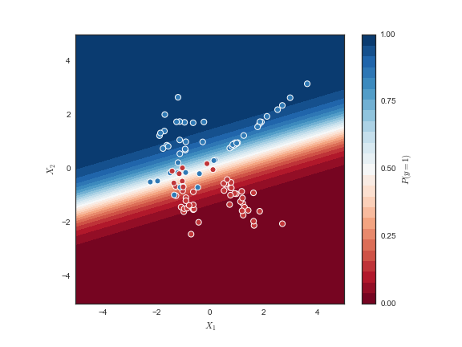

<style>
.white figure img {
  background: white;
}
html.blur .backgrounds {
   -webkit-filter: blur(4px) saturate(.5) brightness(.7);
   -moz-filter: blur(4px) saturate(.7) brightness(.8);
   -o-filter: blur(4px) saturate(.7) brightness(.8);
   -ms-filter: blur(4px) saturate(.7) brightness(.8);
   filter: blur(4px) saturate(.7) brightness(.8);
}
html.dim .backgrounds {
   -webkit-filter: saturate(.5) brightness(.7);
   -moz-filter: saturate(.7) brightness(.8);
   -o-filter: saturate(.7) brightness(.8);
   -ms-filter: saturate(.7) brightness(.8);
   filter: saturate(.7) brightness(.8);
}
@-webkit-keyframes blur-animation {
  0% {
    -webkit-filter: blur(0px) ;
    -moz-filter: blur(0px);
    -o-filter: blur(0px);
    -ms-filter: blur(0px);
    filter: blur(0px);

  }
  100% {
    -webkit-filter: blur(5px) saturate(.5) brightness(.4);
    -moz-filter: blur(6px) saturate(.7) brightness(.5);
    -o-filter: blur(6px) saturate(.7) brightness(.5);
    -ms-filter: blur(6px)saturate(.7) brightness(.5);
    filter: blur(6px) saturate(.7) brightness(.5);

  }
}
html.background-blur-animation .backgrounds {
   -webkit-animation-name: blur-animation;
   -webkit-animation-duration: 5s;
   -webkit-animation-iteration-count: 1;
   -webkit-animation-direction: alternate;
   -webkit-animation-timing-function: ease-out;
   -webkit-animation-fill-mode: forwards;
   -webkit-animation-delay: 0s;
 }
</style>

### About the speaker

<small>

* **Research Fellow**, Wigner Research Centre for Physics, Hungary (2013--present)

* **Postdoctoral Fellow**, California State University, Fresno, USA (2010--2012)

* **Postdoctoral Fellow**, Indiana University, USA (2008--2009)

* **PhD student**, Royal Holloway, University of London, UK (2001--2008)

* **MSc student**, Royal Holloway, University of London, UK (2000--2001)

* **Assistant Research Scientist**, National Physical Laboratory, UK (1998--2000)

* **BSc student**, Royal Holloway, University of London, UK (1993--1996)

</small>

---

## What is Data Science? {.white}


<small>The Data Science Venn Diagram, by Drew Conway</small>

---

## Another interpretation

```{r unicorn, fig.align='center', fig.height=5.5, fig.width=5.5, echo=FALSE, message = FALSE, warning = FALSE, error = FALSE}
require(png)
require(grid)
img <- readPNG("unicorn.png")
grid.raster(img)
```

<small>People with all these skills are rare!</small>

--- 

## What does the "Big Data" landscape look like outside particle physics?

---


<!---
<small>The data science ecosystem is rich and vast!</small>
--->

---

## Where is machine learning used?

---



<!---
<small>Take-away message: there's a huge buzz around machine learning right now, and lots of companies want to use it</small>
--->

---

## What is machine learning?

- Arthur Samuel (1959): Field of study that gives computers the ability to learn
without being explicitly programmed
- Tom Mitchell (1998): A computer program is said to learn from experience $E$ with respect to some task $T$ and some performance measure $P$, if its performance on $T$, as measured by $P$, improves with experience $E$
- Traditional programming versus machine learning:

```{r fig.align='center', fig.height=3, echo=FALSE, message = FALSE, warning = FALSE, error = FALSE}
require(png)
require(grid)
img <- readPNG("boxes.png")
grid.raster(img)
```

---

## Machine learning & particle physics

* Machine learning is more or less what is commonly known in particle physics as multivariate analysis (MVA)
* Used for many years but faced widespread scepticism
* Use of multivariate pattern recognition algorithms was basically taboo in new particle searches until recently
* Much prejudice against using what were considered "black box" selection algorithms
* Artificial neural networks and Fisher discriminants (linear discriminant analysis) were used somewhat in the 1990's
* Boosted Decision Trees (AdaBoost, 1996) is the favourite algorithm used for many analyses (1st use: 2004)
<br>

<small>[Successes, Challenges and Future Outlook of Multivariate Analysis In HEP](http://iopscience.iop.org/article/10.1088/1742-6596/608/1/012058/meta), Helge Voss, 2015 J. Phys.: Conf. Ser. 608 (2015) 012058; [Higgs Machine Learning Challenge visits CERN](http://indico.cern.ch/event/382895/), 19 May 2015, CERN; [Boosted Decision Trees as an Alternative to Artificial Neural Networks for Particle Identification](http://arxiv.org/abs/physics/0408124), Hai-Jun Yang *et al.*, Nucl.Instrum.Meth. A543 (2005) 577-584</small>

---

## Statistical Learning versus Machine Learning

- Machine learning arose as a subfield of Artificial Intelligence.
- Statistical learning arose as a subfield of Statistics
- There is much overlap
- Machine learning has a greater emphasis on large scale applications and prediction accuracy
- Statistical learning emphasizes models and their interpretability, and precision and uncertainty
- But the distinction has become more and more blurred, and there is a great deal of "cross-fertilisation"
- In the following, we'll use the term "machine learning", regardless of the origin of specific methods

---

## Types of machine learning

- **Supervised learning**: learn from examples and make predictions for new data
- **Unsupervised learning**: looking for patterns in the data
- Other types exist (*e.g.*, reinforcement learning, semi-supervised learning, recommender systems)

---

## Supervised learning

- We have an outcome measurement $Y$ (also called dependent variable,
response, target)
- We have a vector of $p$ predictor measurements $X$ (also called regressors, covariates, features, attributes, independent variables)
- In the *regression* problem, $Y$ is quantitative (*e.g.*, price, blood pressure, voltage)
- In the *classification* problem, $Y$ is categorical (*e.g.*, dead/alive, signal/background, digit 0--9, particle type, malignant/benign)
- We have training data $(x_1, y_1),~\dots~,(x_N , y_N)$: $N$ observations (examples, instances, cases, events) of these measurements
- Learns a mapping from the inputs to the outputs

---

## Supervised learning objectives

On the basis of the training data we would like to:

- Accurately predict unseen test cases
- Understand which inputs affect the outcome
- Assess the quality of our predictions and inferences

---

## Unsupervised learning

- No outcome variable, just a set of predictors (features) measured on a set of samples
- Objective is more fuzzy: find groups of samples that behave similarly, find features that behave similarly, find linear combinations of features with the most variation
- Difficult to know how well your are doing
- Different from supervised learning, but can be useful as a pre-processing step for supervised learning

---

## An example of unsupervised learning in HEP {data-background="jets.png" data-state="background-blur-animation"}
### Jet reconstruction

- A jet is a cone-shaped spray of hadrons and other particles produced by the fragmentation of a quark or a gluon
- Jet finding involves clustering (gathering together) charged particle tracks and/or calorimeter energy deposits in a detector
- Exact definition of what constitutes a jet in the detector depends a lot on the specific algorithm used to build jets from the hadrons that are detected
- Jet finding is the approximate attempt to reverse-engineer the process of hadronisation
- Several different approaches and algorithms exist, but the most popular are **sequential recombination algorithms** (aka **hierarchical agglomerative clustering**)
- *Cluster analysis* is a large sub-field of machine learning

---

## Jet reconstruction



Jets are viewed as a proxy to the initial quarks and gluons that we can't measure and are a common feature in high-energy particle collisions

---

### A six-jet event seen by CMS

```{r cms-sixjets, fig.align='center', fig.height=6, echo=FALSE, message = FALSE, warning = FALSE, error = FALSE}
require(png)
require(grid)
img <- readPNG("cms-sixjets.png")
grid.raster(img)
```

View along detector beam axis

---

## Linear regression with one variable

- In regression problems, we are taking input variables and trying to fit the output onto a *continuous* expected result function
- We have a single output $y$ (we are doing supervised learning) and a single feature $x$
- Our hypothesis function has the general form: $\hat{y} = \theta_0 + \theta_1{x}$
- Choose $\theta_0, \theta_1$ so that $\hat{y}$ is close to $y$ for training examples $(x,y)$
- For notational compactness, we can arrange the parameters in a vector:

$$\Theta = \begin{bmatrix}\theta_0 \\ \theta_1\end{bmatrix}$$

---

## Cost (or loss) function

- We can measure the accuracy of our hypothesis function by using a **cost function** (also known as a **loss function**)
- Estimate parameters as the values that minimise the following cost function (sum of squared residuals):

$$
J(\Theta) = \sum_{i=1}^{N} \left( y_i - \hat{y}_i \right)^2
$$

- Squaring the residuals $y_i - \hat{y_i}$ ensures their contribution to $J$ is always positive
- $J$ is a measure of how bad our fit is to the training data

---

## Gradient descent

- We want to find the minimum of the cost function $J$
- The gradient descent algorithm is:
  * Start at some $\Theta_0 = (\theta_0, \theta_1)$
  * Repeat until convergence (measured by some stopping criterion):
  
$$
\Theta_{j+1} = \Theta_{j} - {\alpha}\frac{\partial}{\partial{\Theta_j}}J(\Theta_j)
$$

- $\alpha$ is the *learning rate*
- Intuitively, what we are doing is walking down the cost function $J$ in the direction of the tangent to $J$, with step size controlled by the learning rate $\alpha$, to find the minimum of $J$

---

## Problems with gradient descent

- If $\alpha$ is too small, gradient descent can be slow
- If $\alpha$ is too big, gradient descent might overshoot the minimum, fail to converge, or even diverge
- If $J$ has more than one minimum, gradient descent might get stuck in a local minimum instead of finding the global minimum: the solution can be sensitive to starting point $\Theta_0$

```{r fig.align='center', fig.height=3, echo=FALSE, message = FALSE, warning = FALSE, error = FALSE}
require(png)
require(grid)
img <- readPNG("gradient-descent.png")
grid.raster(img)
```

---

<section><h1>Improvements to gradient descent</h1>

- More sophisticated algorithms than gradient descent are used in practice, but the general principle is the same
- If you are performing linear regression and your training sample has many observations, gradient descent would require a large summation before gradient descent can make a single step $\rightarrow$ can be very slow!
    * We can *parallelise* the computation by breaking the summation into chunks and spreading them across several CPUs
- For each step of gradient descent, we can perform the summation on a randomly chosen single training example; this is **stochastic gradient descent** (SGD)
    * SGD's path to a minimum jitters and is less direct,
    * SGD unlikely to converge at a minimum and will instead wander around it randomly, but usually result is close enough
- Other, more advanced, algorithms are available that are often faster than gradient descent and have the advantage that there is no need to manually pick $\alpha$
  
## Comparison of gradient-based minimisation methods


</section>

---

## Multivariate linear regression

<p align="left">$\bullet$  Linear regression with multiple variables is a trivial extension</p>
<p align="left">$\bullet$  We have a *feature vector* --- our set of features:</p>

$$
X = [x_0, x_1, \cdots, x_p]
$$

<p align="left">$\bullet$  For convenience of notation, we define $x_0 = 1$</p>
<p align="left">$\bullet$  We define our hypothesis function as follows:</p>

$$
\hat{y} = \theta_0 + \theta_1{x_1} + \cdots + \theta_p{x_p} = \Theta^T{X}
$$

<p align="left">$\bullet$  Our cost function is (where $y$ is the vector of all output values):</p>

$$
J(\Theta) = {(y - X\Theta)^T}{(y - X\Theta)}
$$

<p align="left">$\bullet$  Our gradient descent rule becomes:</p>

$$
\Theta_{j+1} = \Theta_{j} - {\alpha}{\nabla}J(\Theta_j)
$$

---

## Feature scaling {data-background="valley.png" data-state="background-blur-animation"}

- Suppose we are performing multivariate linear regression with two features $x_1, x_2$ which differ greatly in scale
- $J(\Theta)$ will have the shape of a bowl that has been "stretched" --- boat shaped, or like a long thin valley
- Gradient descent can be slow as it oscillates inefficiently down to the minimum, bouncing between opposite sides of the "valley"
- Speed up gradient descent by making the features similar in scale
- We can make the ranges of the features the same
- Usually apply z-score normalisation: $x_i^\prime = ({x_i - \bar{x}_i})/{s_i}$, where $\bar{x}_i$ and $s_i$ are the sample mean and standard deviation of feature $i$
- Some machine learning methods (*e.g.*, support vector machines) require feature scaling, and it's good practice to do it anyway, although it's not always necessary
- Often log transform features with skewed distributions

---

## Polynomial regression

- We can improve our features and the form of our hypothesis function in a couple different ways.
- Our hypothesis function need not be linear if that does not fit the data well
- We can add higher-order terms that can also account for interactions between features
- Feature scaling is required to avoid features blowing up (*e.g.*, if $x_1$ has range $1$--$10^3$ then range of $x_1^2$ becomes $1$--$10^6$)
- For a single variable, our hypothesis function looks like this:

$$
\hat{y} = \theta_0 + \theta_1{x_1} + \theta_2{x_1^2} + \cdots + \theta_p{x_1^p}
$$

---

## Polynomial regression on car data



<small>What degree polynomial is best? We'll discuss how this choice is made later.</small>

---

## Logistic regression

- Now switching from regression problems to classification problems
- Don't be confused by the name "logistic regression"; it is named that way for historical reasons
- To start with, consider a binary classification problem where $y \in \{0,1\}$, where 0 is usually taken as the "negative class" and 1 as the "positive class" and
    * 0 = background, 1 = signal
    * 0 = good email, 1 = spam
    * *etc.*
- We could use linear regression to predict the class probabilities, and map all predictions $<$ 0.5 as 1 and $>$ 0.5 as 1, but we run into problems with probabilities less than 0 or greater than 1
- Our hypothesis function should satisfy: $0 \leq \hat{y} \leq 1$

---

## Logistic function

- The function
$$
f(x) = \frac{1}{1+e^{-x}}
$$<br /> shown here, maps any real number to the (0,1) interval, making it useful for transforming an arbitrary-valued function into a function better suited for classification


---

## Logistic regression hypothesis representation

<p align="left">$\bullet$  Logistic regression uses the function:</p>

$$
P(X) = \frac{e^{\theta_0 + \theta_1{x_1} + \cdots + \theta_p{x_p}}}{1+e^{\theta_0 + \theta_1{x_1} + \cdots + \theta_p{x_p}}}
$$

<p align="left">$\bullet$  or, more compactly:</p>

$$
P(X) = \frac{e^{\Theta^T{X}}}{1+e^{\Theta^T{X}}}
$$

<p align="left">$\bullet$  A bit of rearrangement gives:</p>

$$
\log\left(\frac{P(X)}{1-P(X)}\right) = \theta_0 + \theta_1{x_1} + \cdots + \theta_p{x_p} = \Theta^T{X}
$$

<p align="left">$\bullet$  This transformation is called the *log odds* or *logit* of $P(X)$</p>

---

## From probabilities to class predictions

- To estimate the parameters $\Theta$, we can use gradient descent with the cost function:

$$
J(\Theta) = (-y^{T}\log(\hat{y})-(1-y)^{T}\log(1-\hat{y}))
$$

- In order to get our discrete 0 or 1 classification, we can translate the output of the hypothesis function as follows:

$$
\hat{y} \geq 0.5 \implies y = 1\\
\hat{y} < 0.5 \implies y = 0\\
$$

- The *decision boundary* is the line that separates the area where $y=0$ and where $y=1$

---

## Logistic regression decision boundary

- Logistic regression classifies new samples based on any threshold you want, so it doesn't inherently have one *decision boundary*; here we show a contour plot for a range of threshold values:



---

## Confusion matrix

- A confusion matrix is a (contingency) table that is often used to describe the performance of a classification model, for example:

```{r fig.align='center', fig.height=1.75, echo=FALSE, message = FALSE, warning = FALSE, error = FALSE}
require(png)
require(grid)
img <- readPNG("confusion1.png")
grid.raster(img)
```

- Types of errors:
      * *False positive rate*: The fraction of negative examples that are
classified as positive
      * *False negative rate*: The fraction of positive examples that are
classified as negative
- We can change the two error rates by changing the threshold from 0.5 to some other value in [0, 1]

---

## ROC curve

- A *receiver operating characteristic (ROC)*, or *ROC curve*, is a graphical plot that illustrates the performance of a binary classifier:

```{r fig.align='center', fig.height=3, echo=FALSE, message = FALSE, warning = FALSE, error = FALSE}
require(png)
require(grid)
img <- readPNG("roc.png")
grid.raster(img)
```

- Displays both the false positive and false negative rates
- The ROC curve is traced out as we change the threshold
- Sometimes we use the *AUC* or *area under the curve* to summarise the overall performance (higher AUC is good)

---

## The problem of overfitting

- If we have too many features, the learned hypothesis may fit the training data very well but fail to generalize to new examples
- Example: linear regression

```{r fig.align='center', fig.height=3, echo=FALSE, message = FALSE, warning = FALSE, error = FALSE}
require(png)
require(grid)
img <- readPNG("overfit1.png")
grid.raster(img)
```

---

## An example of overfitting in classification


---

## Regularisation

- Regularization is designed to address the problem of overfitting
- This technique that *constrains* or *regularises* the coefficient estimates, or equivalently, that shrinks the coefficient estimates towards zero
- It may not be immediately obvious why such a constraint should improve the fit, but it turns out that shrinking the coefficient estimates can significantly reduce their variance

---

## Ridge regression

- The least squares fitting procedure in linear regression estimates the parameters $\Theta$ for $p$ features using the values that minimise:

$$
J(\Theta) = \sum_{i=1}^{N} \left( y_i - \hat{y}_i \right)^2 = \sum_{i=1}^{N} \left( y_i - \theta_0 + \sum_{j=1}^{p}{\theta_{j}{x_{ij}}} \right)^2
$$

- In contrast, the ridge regression coefficient estimates are the values that minimize (where $\lambda \geq 0$ is a tuning parameter to be determined separately):

$$
J(\Theta) = \sum_{i=1}^{N} \left( y_i - \theta_0 + \sum_{j=1}^{p}{\theta_{j}{x_{ij}}} \right)^2 + \lambda\sum_{j=1}^{p}{\theta_j^2}
$$

---

## Ridge regression: continued

- As with least squares, ridge regression seeks coefficient estimates that fit the data well, by making the RSS small
- However, the second term in the cost function, $\lambda\sum_j{\theta_{j}^2}$, called the *shrinkage penalty*, is small when the $\Theta$ are close to zero, and so it has the effect of shrinking the estimates of $\Theta$ towards zero
- The tuning parameter $\lambda$ serves to control the relative impact of these two terms on the regression coefficient estimates
- The shrinkage penalty sets the budget for how large the coefficient estimates can be; we minimise the RSS subject to $\sum_j{\theta_{j}^2} \leq s$
- Selecting a good value for $\lambda$ is critical; use *cross-validation*
- Regularisation used for both regression and classification
- Feature scaling must be used due to the sum of squared coefficients in the shrinkage term

---

## Regularisation: some intuition

- By shrinking some of the coefficient estimates towards zero, we reduce the influence of some of the features on the model, thereby making it less complex; $\lambda$ the model flexibility
- We can use regularisation to smooth the output of our hypothesis function to reduce overfitting
- If $\lambda$ is chosen to be too large, it may smooth out the function too much and cause underfitting
- To help you think about this:
    * Imagine you're performing a least squares fit to some data with sticks of spaghetti; how long you cook the spaghetti for controls how well you can bend it to fit the data!
    * If you overcook, you'll be able to fit every data point, in effect *memorising* the training data --- but the resultant model will not generalise to new data points, and is useless
    
---

## Selecting $\lambda$ for Ridge Regression
### (A brief look-ahead at cross-validation, before we explore in more depth)

- Ridge regression requires a method to determine which of the models under
consideration is best
- That is, we require a method selecting a value for the tuning parameter $\lambda$
- *Cross-validation* provides a simple way to tackle this problem. We choose a grid of $\lambda$ values, and compute the cross-validation error rate for each value of $\lambda$
- We then select the tuning parameter value for which the cross-validation error is smallest
- Finally, the model is re-fit using all of the available observations and the selected value of the tuning parameter

---

## Training error versus test error

- The *test error* is the average error that results from using a statistical learning method to predict the response on a new observation, one that was not used in training the method
- In contrast, the *training error* can be easily calculated by applying the statistical learning method to the observations used in its training
- But the training error rate often is quite different from the
test error rate, and in particular the former can **dramatically underestimate** the latter

---

## Training- versus Test-Set Performance

```{r fig.align='center', fig.height=5, echo=FALSE, message = FALSE, warning = FALSE, error = FALSE}
require(png)
require(grid)
img <- readPNG("alkeM.png")
grid.raster(img)
```

- Left: underfitting, right: overfitting
- Optimal model is where the test error is at a minimum

---

## Validation set approach to estimate test error

- Here we randomly divide the available set of samples into two parts: a *training set* and a *validation* or *hold-out set*
- The model is fit on the training set, and the fitted model is used to predict the responses for the observations in the validation set
- Validation set error provides an estimate of the test error
- Most common scheme used in HEP, if any is used at all!

---

## Model selection and train/validation/test sets

- If we perform model selection or tune paramaters such as polynomial degree (for polynomial regression) or the regularisation parameter $\lambda$ using the test set, the error estimate is very likely to be overly optimistic
- To solve this, we can introduce a third set, the *cross-validation set*, to serve as an intermediate set that we can use to perform tuning and model selection, *e.g.*:
    * Optimise the parameters in $\Theta$ using the training set for each tuning parameter value
    * Pick the tuning parameter with the lowest error evaluated on the CV set
    * Estimate the generalisation error using the test set
- A typical train/CV/test split is 60%/20%/20%

---

## Drawbacks of validation set approach

- The validation estimate of the test error can be highly variable, depending on precisely which observations are included in the training set and which observations are included in the validation set
- In the validation approach, only a subset of the observations --- those that are included in the training set rather than in the validation set --- are used to fit the model
- This suggests that the validation set error may tend to *overestimate* the test error for the model fit on the entire data set

---

## $K$-fold cross-validation

- Widely used approach for estimating test error
- Estimates can be used to select best model, and to give an idea of the test error of the final chosen model
- Idea is to randomly divide the data into $K$ equal-sized parts. We leave out part $k$, fit the model to the other $K − 1$ parts (combined), and then obtain predictions for the left-out $k$th part
- This is done in turn for each part $k = 1, 2, \dots, K$
- The $k$ results from the folds can then be averaged to produce a single estimation
- The advantage of this method over the simple hold-out method is that all observations are used for both training and validation, and each observation is used for validation exactly once
- Typical values for $K$ are 5 or 10

---

## $K$-fold cross-validation illustrated

```{r fig.align='center', fig.height=6, echo=FALSE, message = FALSE, warning = FALSE, error = FALSE}
require(png)
require(grid)
img <- readPNG("cross-validation.png")
grid.raster(img)
```

---

## What to do next?

- What do we do next, after having used cross-validation to choose a value of a tuning parameter (*e.g.,* $\lambda$)?
- It may be an obvious point, but worth being clear: we now fit our estimator to the *entire* training set using the tuning parameter value we obtained
- Deploy model!

---

## Model selection versus model evaluation

- Cross-validation is used for both model selection/tuning and to evaluate the test error of the final chosen model
- Should we use the error obtained on the CV set during model selection/tuning as an estimate of the test error of the final chosen model? No!
- The CV error estimate is likely to be overly optimistic, because we obtained it using the same observations as those used to select/tune the model to optimise performance!
- The solution is to use an *outer loop* of cross-validation to estimate the performance of the final model

---

## Nested $K$-fold cross validation illustrated

```{r fig.align='center', fig.height=6, echo=FALSE, message = FALSE, warning = FALSE, error = FALSE}
require(png)
require(grid)
img <- readPNG("nested-k-fold.png")
grid.raster(img)
```

---

## Nested cross validation: some final details

- If you use cross validation to estimate the hyperparameters of a model and then use those hyperparameters to fit a model to the whole dataset, then that is fine, provided that you recognise that the cross validation estimate of performance is likely to be (possibly substantially) optimistically biased
- This is because part of the model (the hyperparameters) have been selected to optimise the cross validation performance, so if the cross validation statistic has a non-zero variance (and it will) there is the possibility of overfitting the model selection criterion
- If you want to choose the hyperparameters and estimate the performance of the resulting model then you need to perform a nested cross-validation, where the outer cross validation is used to assess the performance of the model, and the inner cross validation is used to determine the hyperparameters

---

## Information leakage

- Information leakage is the creation of unexpected additional information in the training data, allowing a model or machine learning algorithm to make unrealistically good predictions
- Leakage is a pervasive challenge in applied machine learning, causing models to over-represent their generalization error and often rendering them useless in the real world
- Given that methods such as cross validation and other steps to protect against information leakage are largely unknown in the HEP community, it's reasonable to assume that it occurs in HEP analyses frequently

---

## Information leakage examples

- If you evaluate the performance of your final model using test data, and tune your model to get a better result, you are using the test data for tuning!
- If you apply feature scaling on the whole data set before creating partitions or folds, the means and standard deviations (and any data transformation parameters) have seen the test data!
- If you choose the features for your model before creating partitions or folds, you are using information from the test data, and you get choose uninformative features that are spuriously correlated with the output $\rightarrow$ useless final model!
- If you tune *any* cuts using the test data, your final model is likely to have overly optimistic performance!
    * This is true even if you are using simple one-dimensional rectangular cuts on variables --- *i.e.*, the traditional cut-based method commonly used in HEP!

---

## Feature selection
### Problems of too many features

- Correlated features can skew prediction
- Irrelevant features (not correlated to class variable) cause unnecessary blowup of the model space
- Irrelevant features can drown the information provided by informative features in noise
- Irrelevant features in a model reduce its explanatory value (also when predictive accuracy is not reduced)
- Training may be slower and more computationally expensive
- Increased risk of overfitting

---

## Redundant & irrelevant features

- What should we do when it is likely that the data contains many redundant or irrelevant features?
- **Redundant features** are those which provide no more information than the currently selected features
- **Irrelevant features** provide no useful information in any context
- Various methods exist to remove them:
    * *Wrapper methods* consider the selection of a set of features as a search problem, where different combinations are prepared, evaluated and compared to other combinations --- typically slow but give good performance
    * *Filter methods* apply a statistical measure to assign a scoring to each feature --- fast, but consider each feature independently
    * *Embedded methods* learn which features best contribute to the accuracy of the model while the model is being created
  
---

## Choosing a classifier

- We have only considered simple linear models so far
- Linear models are seldom correct, but they can be informative!
- In some cases, the true relationship between the input and output might actually be close to linear --- so a more complex model will not increase performance much
- Simple models may do as well as complex models if the features are uniformative
- In any case, your "go-to" algorithm before trying anything else should be a simple linear model; this will give you a baseline with which to compare against
- Boosted decision trees and neural nets are fashionable in HEP nowadays, but in some cases a simple model might get reasonable performance and be more interpretable, and is probably easy to tune and faster to train

---

One advantage of crude models is that we know they are crude and will not try to read too much from them. With more sophisticated models,

> ... there is an awful temptation to squeeze the lemon until it is dry and to present a picture of the future which through its very precision and verisimilitude carries conviction. Yet a man who uses an imaginary map, thinking it is a true one, is like to be worse off than someone with no map at all; for he will fail to inquire whenever he can, to observe every detail on his way, and to search continuously with all his senses and all his intelligence for indications of where he should go.

From *Small is Beautiful* by E. F. Schumacher

---

# That's probably enough theory for now!

---

