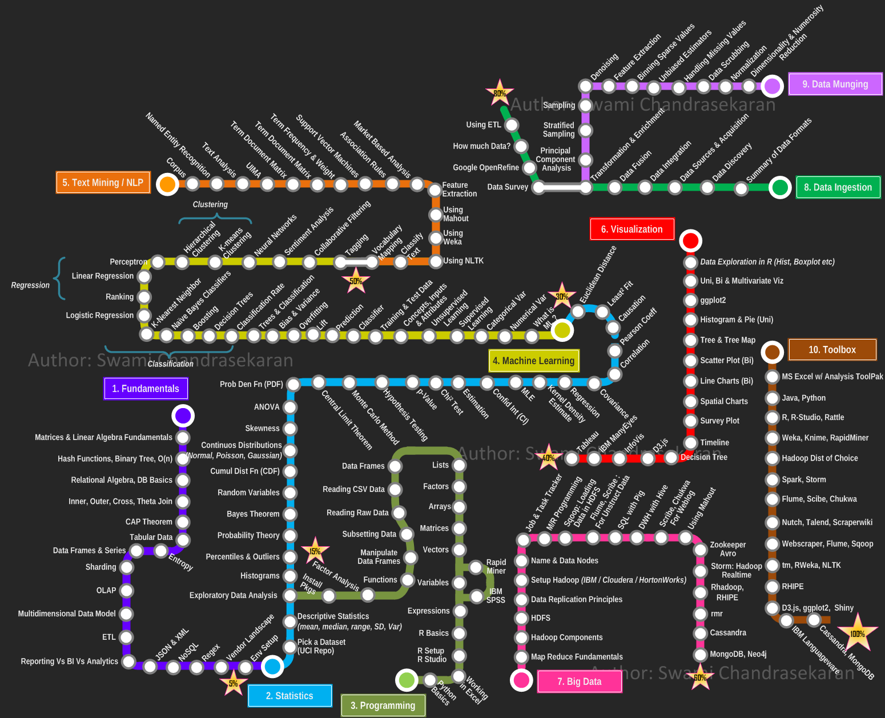
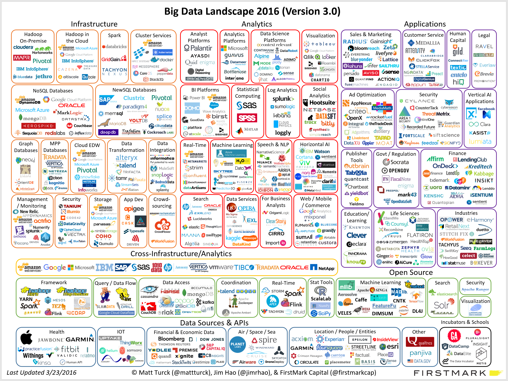
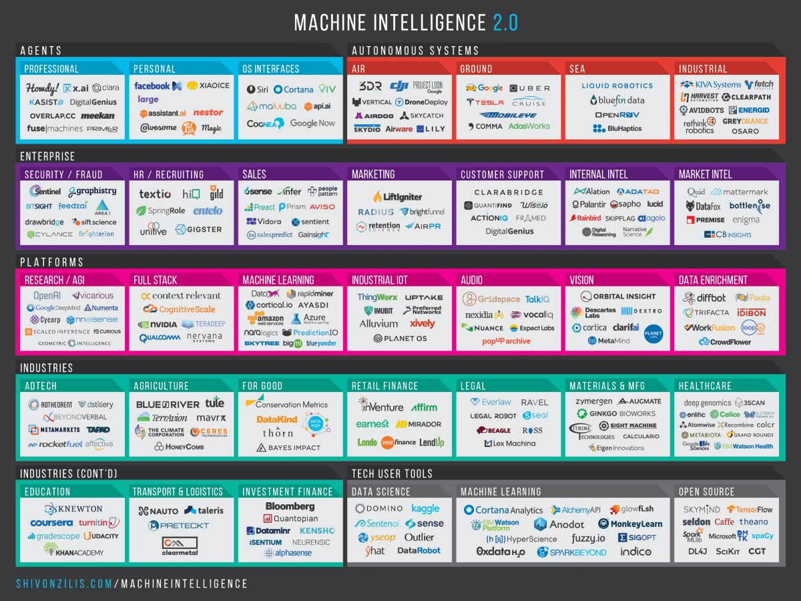

<style>
.white figure img {
  background: white;
}
html.blur .backgrounds {
   -webkit-filter: blur(4px) saturate(.5) brightness(.7);
   -moz-filter: blur(4px) saturate(.7) brightness(.8);
   -o-filter: blur(4px) saturate(.7) brightness(.8);
   -ms-filter: blur(4px) saturate(.7) brightness(.8);
   filter: blur(4px) saturate(.7) brightness(.8);
}
html.dim .backgrounds {
   -webkit-filter: saturate(.5) brightness(.7);
   -moz-filter: saturate(.7) brightness(.8);
   -o-filter: saturate(.7) brightness(.8);
   -ms-filter: saturate(.7) brightness(.8);
   filter: saturate(.7) brightness(.8);
}
</style>

### About the speaker
<small>

* **Research Fellow**, Wigner Research Centre for Physics, Hungary (2013--present)

* **Postdoctoral Fellow**, California State University, Fresno, USA (2010--2012)

* **Postdoctoral Fellow**, Indiana University, USA (2008--2009)

* **PhD student, particle physics**, Royal Holloway, University of London, UK (2001--2008)

* **MSc student, particle physics**, Royal Holloway, University of London, UK (2000--2001)

* **Assistant Research Scientist**, National Physical Laboratory, UK (1998--2000)

* **BSc student, physics**, Royal Holloway, University of London, UK (1993--1996)

</small>


## Overview

---

## What is Data Science? {.white}


<small>The Data Science Venn Diagram, by Drew Conway</small>

---

## Another interpretation


<small>People with all these skills are rare!</small>

--- 

## What's the roadmap to acquire the all skills of an ideal data scientist?

---



---

## What does the "Big Data" landscape look like outside particle physics?

---



---

## Where is machine learning used?

---



---

## What is machine learning?

- Arthur Samuel (1959): Field of study that gives computers the ability to learn
without being explicitly programmed
- Tom Mitchell (1998): A computer program is said to learn from experience $E$ with respect to some task $T$ and some performance measure $P$, if its performance on $T$, as measured by $P$, improves with experience $E$
- Traditional programming versus machine learning:


---

## Machine learning & particle physics

* Machine learning is more or less what is commonly known in particle physics as multivariate analysis (MVA)
* Used for many years but faced widespread scepticism
* Use of multivariate pattern recognition algorithms was basically taboo in new particle searches until recently
* Much prejudice against using what were considered "black box" selection algorithms
* Artificial neural networks and Fisher discriminants (linear discriminant analysis) were used somewhat in the 1990's
* Boosted Decision Trees (AdaBoost, 1996) is the favourite algorithm used for many analyses (1st use: 2004)
<br>

<small>[Successes, Challenges and Future Outlook of Multivariate Analysis In HEP](http://iopscience.iop.org/article/10.1088/1742-6596/608/1/012058/meta), Helge Voss, 2015 J. Phys.: Conf. Ser. 608 (2015) 012058; [Higgs Machine Learning Challenge visits CERN](http://indico.cern.ch/event/382895/), 19 May 2015, CERN; [Boosted Decision Trees as an Alternative to Artificial Neural Networks for Particle Identification](http://arxiv.org/abs/physics/0408124), Hai-Jun Yang *et al.*, Nucl.Instrum.Meth. A543 (2005) 577-584</small>

---

## Types of machine learning

- Supervised learning
- Unsupervised learning


---

## Supervised learning

- We have an outcome measurement $Y$ (also called dependent variable,
response, target)
- We have a vector of $p$ predictor measurements $X$ (also called regressors, covariates, features, attributes, independent variables)
- In the *regression* problem, $Y$ is quantitative (*e.g.*, price, blood pressure, voltage)
- In the *classification* problem, $Y$ is categorical (*e.g.*, dead/alive, signal/background, digit 0--9, particle type)
- We have training data $(x_1, y_1),~\dots~,(x_N , y_N)$: $N$ observations (examples, instances, cases, events) of these measurements
- Learns a mapping from the inputs to the outputs

---

## Supervised learning objectives

On the basis of the training data we would like to:

- Accurately predict unseen test cases
- Understand which inputs affect the outcome, and how
- Assess the quality of our predictions and inferences

---

## Unsupervised learning

- No outcome variable, just a set of predictors (features) measured on a set of samples.
- Objective is more fuzzy: find groups of samples that behave similarly, find features that behave similarly, find linear combinations of features with the most variation
- Difficult to know how well your are doing
- Different from supervised learning, but can be useful as a pre-processing step for supervised learning

---

## An example of unsupervised learning in particle physics


- A jet is a cone-shaped spray of hadrons and other particles produced by the fragmentation of a quark or a gluon
- Jet finding involves clustering (gathering together) charged particle tracks and/or calorimeter energy deposits in a detector

---

<section>


- For experimental particle physics, [ROOT](http:://root.cern.ch) is the ubiquitous data analysis tool, and has been for the last 20 years old
- Command language: CINT/CLING ("interpreted C++") or Python
    * Small data: work interactively or run macros
    * Big data: compile with ROOT libraries, run on Grid
- Data format optimised for large data sets
- Complex algorithms are difficult to do interactively
- End up writing huge C++ programs
- Lots of tweaking, endless edit-compile-run loops 😱

<small>See *Highlights and Analysis of the Answers to the ROOT Users' Survey*, ["ROOT Turns 20" Users' Workshop](http://indico.cern.ch/event/349459/), 15-18 September 2015, Saas-Fee, Switzerland</small>

## ROOT data access

- Data in ROOT "tree" (like a hierarchical database)
- An entry represents an event (*i.e.*, a collison)
    * "Branches" (electrons, muons, photons, *etc.*)
        - "Leaves" (energy, momentum, mass, *etc.*)
- Basic idea: don't need all of the data all of the time
- Trees in many different files --- perhaps on different computers --- can be merged into one "chain"
- Access data in chain as if it was a tree in a single file
- Plot a histogram like this:

```c
myTree.Draw("electron.Pt()")
```

</section>

---

## On C++ and data analysis

- Is C++ a good choice for data analysis?
- Spend days coding something that runs in minutes **or**
- Write something in a couple of hours that will run during your lunch break?
- Which will get you your answer faster? What strategy will help you define where you should be focusing your efforts and which paths lead to dead-ends?
- [Larry Wall](https://www.youtube.com/watch?v=LR8fQiskYII), creator of [Perl](https://www.perl.org) (speaking about differences in the number of lines of code needed to accomplish the same task using different languages):

*"You can eat a one-pound stake, or a 100 pounds of shoe leather, and you feel a greater sense of accomplishment after the shoe leather, but maybe there's some downsides..."*

---


## Why did I choose R? {data-background="typing.gif" data-state="dim"}

- Chief among those were the need for fast prototyping and high-level abstractions that let me concentrate on what I wanted to achieve, rather than on the mechanics and the highly-granular details of how I might do it
- Incredibly easy to express what I want to achieve
- Exponentially-growing number of add-on packages
- Latest machine learning algorithms are available
- About 2 million R users worldwide$^*$; technical questions are answered extremely quickly (if not already)
- Not as fast as C++, but my goal is to quickly test new ideas rather than implement a final model
- Beautiful plots
- Fun to work with ☺

<br><small>* <http://www.inside-r.org/what-is-r></small>


