---
output:
  revealjs::revealjs_presentation:
    fig_width: 7
    fig_height: 1
    incremental: false
    theme: league
    highlight: espresso
    center: true
    smart: true
    transition: fade
    reveal_options:
      slideNumber: true
    fig_caption: true
    css: stylesheet.css
    widgets: [mathjax]       # {mathjax, quiz, bootstrap}
    mode: standalone      # {standalone, draft}
---

## Quark/gluon jet discrimination:<br>a reproducible analysis using R

Andrew John Lowe

*Wigner Research Centre for Physics,<br>Hungarian Academy of Sciences*

<style>
.reveal {
font-size: 2em;
}
.reveal h1,
.reveal h2 {
font-family: "Quicksand", sans-serif;
font-weight: 900;
font-size: 175%;
letter-spacing: -0.08em;
text-transform: uppercase;
text-shadow: true; }
.reveal h5 {
color: black;
-webkit-transform: translate(0%, -800%);
-moz-transform: translate(0%, -800%);   
-o-transform: translate(0%, -800%);
-ms-transform: translate(0%, -800%);
transform: translate(0%, -800%);
}
.white figure img {
background: white;
}
html.blur .backgrounds {
-webkit-filter: blur(4px) saturate(.5) brightness(.6);
-moz-filter: blur(4px) saturate(.5) brightness(.6);
-o-filter: blur(4px) saturate(.5) brightness(.6);
-ms-filter: blur(4px) saturate(.5) brightness(.6);
filter: blur(4px) saturate(.5) brightness(.6);
}
html.dim .backgrounds {
-webkit-filter: saturate(.5) brightness(.6);
-moz-filter: saturate(.5) brightness(.6);
-o-filter: saturate(.5) brightness(.6);
-ms-filter: saturate(.5) brightness(.6);
filter: saturate(.5) brightness(.6);
}
@-webkit-keyframes blur-animation {
0% {
-webkit-filter: blur(0px) ;
-moz-filter: blur(0px);
-o-filter: blur(0px);
-ms-filter: blur(0px);
filter: blur(0px);

}
100% {
-webkit-filter: blur(4px) saturate(.5) brightness(.66);
-moz-filter: blur(4px) saturate(.5) brightness(.66);
-o-filter: blur(4px) saturate(.5) brightness(.66);
-ms-filter: blur(4px) saturate(.5) brightness(.66);
filter: blur(4px) saturate(.5) brightness(.66);

}
}
@-webkit-keyframes dim-animation {
0% {
-webkit-filter: blur(0px) ;
-moz-filter: blur(0px);
-o-filter: blur(0px);
-ms-filter: blur(0px);
filter: blur(0px);

}
100% {
-webkit-filter: blur(0px) saturate(.5) brightness(.4);
-moz-filter: blur(0px) saturate(.5) brightness(.4);
-o-filter: blur(0px) saturate(.5) brightness(.4);
-ms-filter: blur(0px) saturate(.5) brightness(.4);
filter: blur(0px) saturate(.5) brightness(.4);

}
}
html.background-blur-animation .backgrounds {
-webkit-animation-name: blur-animation;
-webkit-animation-duration: 1s;
-webkit-animation-iteration-count: 1;
-webkit-animation-direction: alternate;
-webkit-animation-timing-function: ease-out;
-webkit-animation-fill-mode: forwards;
-webkit-animation-delay: 0s;
}
html.background-dim-animation .backgrounds {
-webkit-animation-name: dim-animation;
-webkit-animation-duration: 1s;
-webkit-animation-iteration-count: 1;
-webkit-animation-direction: alternate;
-webkit-animation-timing-function: ease-out;
-webkit-animation-fill-mode: forwards;
-webkit-animation-delay: 0s;
}
#sidebar {
-webkit-transform: rotate(270deg) translate(0px, -500px);
-moz-transform: rotate(270deg) translate(0px, -500px);   
-o-transform: rotate(270deg) translate(0px, -500px);
-ms-transform: rotate(270deg) translate(0px, -500px);
transform: rotate(270deg) translate(0px, -500px);
}
.emphasized {
color: gray;
font-size: 5em;
}
.col2 {
columns: 2 200px;         /* number of columns and width in pixels*/
-webkit-columns: 2 200px; /* chrome, safari */
-moz-columns: 2 200px;    /* firefox */
-o-columns: 2 200px;
-ms-columns: 2 200px;
}
.big {
font-size: 15.0em;
}
.footer {
    color: grey; background: none;
    text-align:left; width:100%;
}
.left {
    text-align:left;
}
.right {
    text-align:right;
}
</style>

## Overview

- This talk will present a walk-through of the development of a prototype machine learning classifier for differentiating between quark and gluon jets at experiments like those at the LHC.
- A new fast feature selection method that combines information theory and graph analytics will be outlined. This method has found new variables that promise significant improvements in discrimination power.
- The prototype jet tagger is simple, interpretable, parsimonious, and computationally extremely cheap, and therefore might be suitable for use in trigger systems for real-time
data processing.
- The data analysis was performed entirely in the R statistical programming language, and is fully reproducible. The entire analysis workflow is data-driven, automated and runs on very modest hardware with no human intervention.

## The problem in a nutshell

- Beams of energetic protons collide inside our detector
- Quarks and gluons emerge and decay into sprays of particles
- Algorithms cluster these decay products into jets
- For each jet, we'd like to know what initiated it:
    - Was it a quark or a gluon?
- Being able to accurately discriminate between quark- and gluon-initiated jets would be an extremely powerful tool in the search for new particles and new physics
- This is an archetypal classification problem that might be amenable to machine learning

<!--
## Machine learning & HEP {data-background="neural.jpg" data-state="background-dim-animation"}

* Machine learning is more or less what is commonly known in particle physics as multivariate analysis (MVA)
* Used for many years but faced widespread scepticism
* Use of multivariate pattern recognition algorithms was basically taboo in new particle searches until recently
* Much prejudice against using what were considered "black box" selection algorithms
* Artificial neural networks and Fisher discriminants (linear discriminant analysis) were used somewhat in the 1990's
* Boosted Decision Tree (AdaBoost, 1996) is the favourite algorithm used for many analyses (1st use: 2004)


<small>[Successes, Challenges and Future Outlook of Multivariate Analysis In HEP](http://iopscience.iop.org/article/10.1088/1742-6596/608/1/012058/meta), Helge Voss, 2015 J. Phys.: Conf. Ser. 608 (2015) 012058; [Higgs Machine Learning Challenge visits CERN](http://indico.cern.ch/event/382895/), 19 May 2015, CERN; [Boosted Decision Trees as an Alternative to Artificial Neural Networks for Particle Identification](http://arxiv.org/abs/physics/0408124), Hai-Jun Yang *et al.*, Nucl.Instrum.Meth. A543 (2005) 577-584</small>
-->

## Goal

We want a simple, interpretable, parsimonious, preferably computationally cheap model that is informative and actually stands a reasonable chance of being deployed at some point in the future. We would also like to spend our limited CPU cycles on robust testing, rather than a complex model.

(This is not a Kaggle competition!)

## Data production pipeline

* Generate Monte Carlo simulated data with lots of jets
    - *pp* at 7 TeV, Pythia 6
    - Jets reconstructed using FastJet, Anti-*k*ᴛ with a radial parameter of 0.4, and these serve as our "detector-level" objects
* Use my C++ code to fill ROOT ntuples with engineered features
* Attach ground-truth class labels ("quark"/"gluon") to each jet
    - Significant class noise (mislabelled jets) at the 5--10% level
    - Procedure sometimes fails to assign class (missing labels)
    - Several labelling schemes exist, but none are perfect because Monte Carlo simulation cannot perfectly simulate real data
* Write-out data and convert for use in R using **RootTreeToR**

## Truth labelling assumptions

- Assume as "ground truth" that light jets have a discrete flavour
- Furthermore, we assume that we have a method that can assign a partonic flavour label with high efficiency
- However, such methods are not unambiguous and are not strictly identical for different MC generators
- Definitions are not theoretically robust, but studies (with MADGRAPH) have shown that for most generators, truth labelling using the highest-energy parton that points to the jet is identical to matrix-element-based labelling for 90-95% of (isolated) jets
- We would like to have more confidence in the assigned truth labels, so we use an ensemble method to filter the training data

## Jet labelling by ensemble

- Jets labelled using the partons in the generator event record
- Used an ensemble labelling scheme with 5 members:
- Use flavour of parton with highest transverse momentum...
    1. within radius equal to radius parameter of the jet algorithm; this is identical to the scheme used by ATLAS*
    2. ghost-associated with jet during clustering
- QCD-aware jet labelling: cluster *final* partons into jet, only allowing clustering steps that obey QCD and QED Feynman rules, then label particle jet with parton jet...
    3. within radius equal to radius parameter of the jet algorithm
    4. ghost-associated with jet during clustering
    5. *k*ᴛ-based reclustering of final partons to anti-*k*ᴛ particle jets
    
<small>
* "Light-quark and gluon jet discrimination in $pp$ collisions at $\sqrt{s}=\mathrm{7\,TeV}$ with the ATLAS detector", Eur.Phys.J. C74 (2014) 3023; "Light-quark and Gluon Jets in ATLAS: Calorimeter Response, Jet Energy Scale Systematics, and Sample Characterization", ATLAS-CONF-2011-053, Mar. 2011, also ATLAS-CONF-2012-138, Sept. 2012
</small>
    
## 

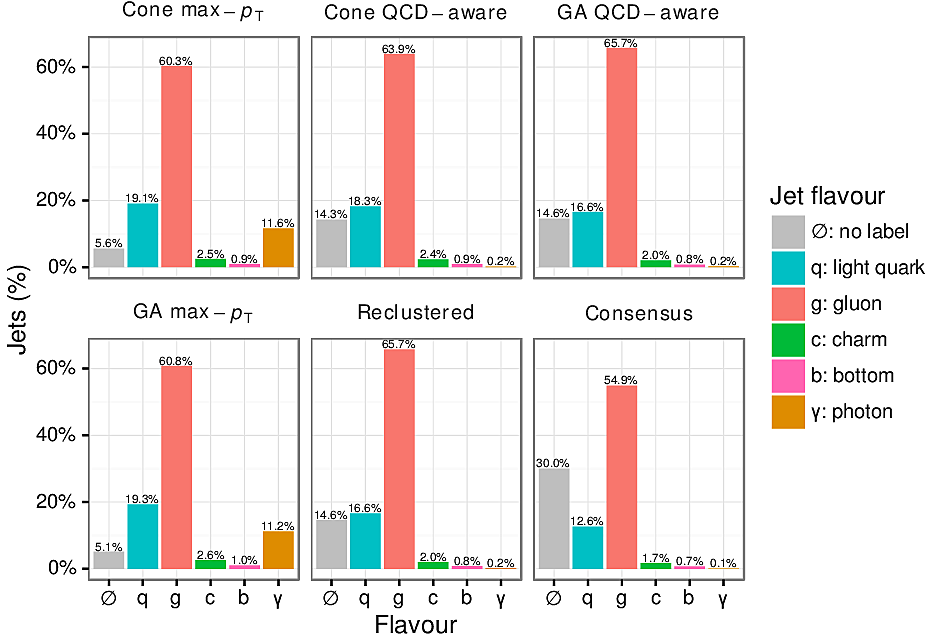

## Relationship between different labelling schemes

- We can explore how the labelling schemes differ by examining tables that are essentially adjacency matrices for each pair of schemes
- Instead of trying to scrutinise several tables of numbers, we instead plot the pairwise relationships for all five schemes using a chord diagram, which is a compact way to represent the data
- Next: all pairings, and pairings with mismatched labels


## 

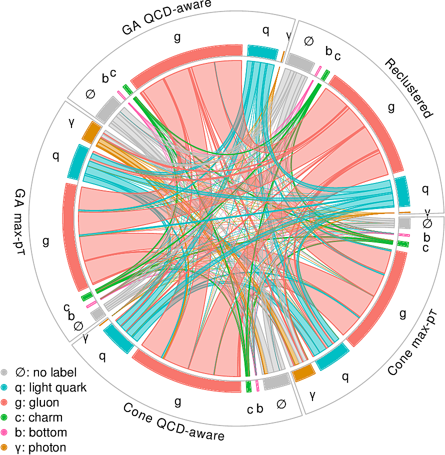


## 

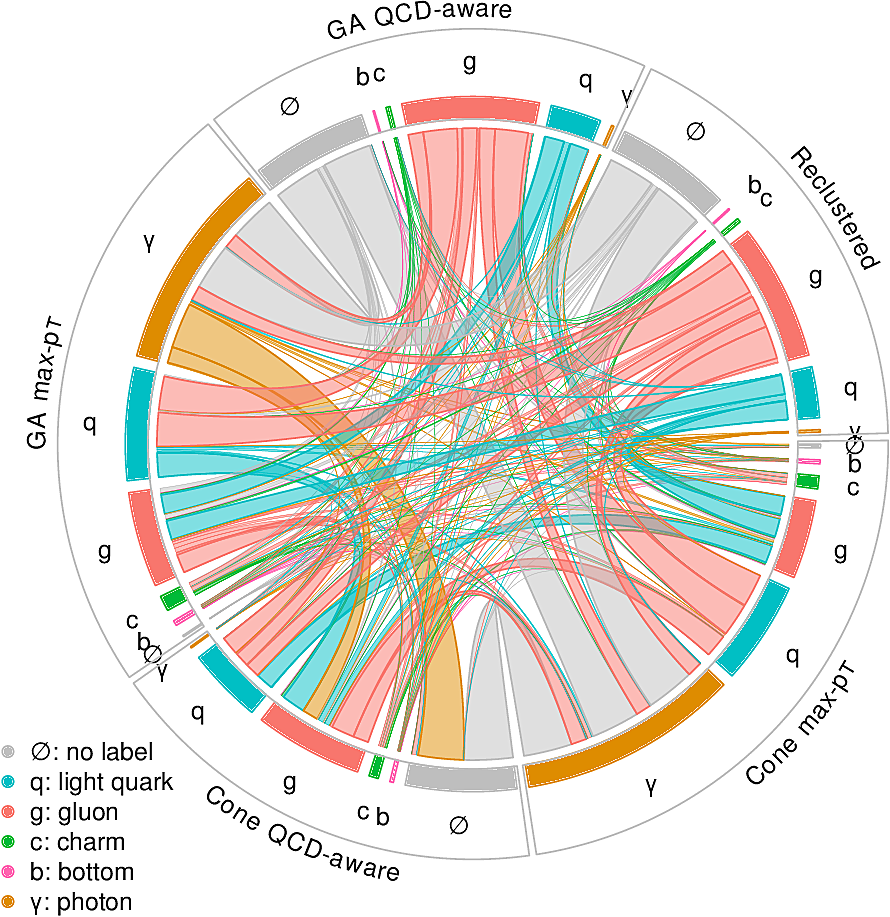


## Relationship between different labelling schemes

- There is good agreement in general, but we observe that the "max-$p_\mathrm{T}$" schemes tend to label more jets as photon-initiated, that would otherwise be labelled by the QCD-aware schemes as gluon-initiated or having no label assigned
- A similar pattern of behaviour was reported in *QCD-aware partonic jet clustering for truth-jet flavour labelling*, Buckley, A. & Pollard, C. Eur. Phys. J. C (2016) 76: 71

## Jet filtering

- Impose a requirement that the jets are isolated to restrict contamination from wide-angle QCD radiation
    - For each jet, require no other jet within 2.5 times the jet radial parameter of the jet axis (we did this already for the chord diagrams on the previous slides)
- Discard jets for which no label could be assigned
- Discard heavy-flavour jets; they are not the subject of this analysis
* Single-track jets are removed; it is not possible to construct a meaningful observable for these jets (we need substructure)
- Reject jets for which there is not concensus between label schemes
- To track *intercoder agreement*, we use Krippendorff's α
    - Works in the presence of missing data
    - 0 = no agreement, 1 = perfect agreement; our data: 0.8

## Jet filtering justification

- It is axiomatic that the performance of any discrimination algorithm will be measured with respect to its ability to predict the ground-truth class labels (the jet partonic flavour)
- If we had perfect understanding of the dynamics of QCD, we could deduce the *Bayes optimal decision boundary* that best separates quark- and gluon-initiated jets
- We attempt to use machine learning to learn an approximation to the Bayes decision boundary
- *Label noise* (mislabelled jets) blurs and obfuscates this decision boundary, which can thwart a machine learning classifier
- Rather than engineer a more complex classifier, we instead engineer our *training data* to more clearly expose the structure in it

## Data exploration

* Missingness and floating-point types
* Variation in magnitude
* Correlations and partial correlations

## 

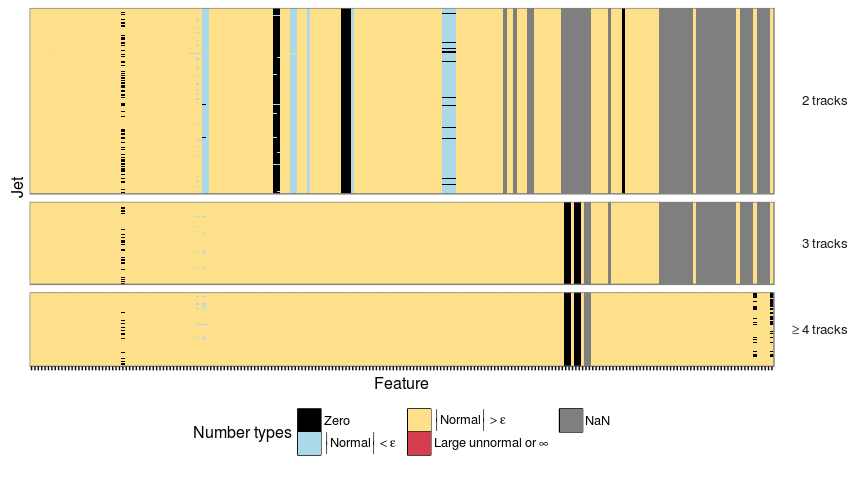


## Missingness and categorisation of data values

* Data stratified by number of tracks per jet
* Instances for which no physically-meaningful value can be assigned
    - These are *missing not at random* (MNAR): missing observations related to values of
unobserved data
* Many small values below machine ε that are due to round-off error in floating point arithmatic
    - Variation in their values is not real; reset these values to zero
    - Small values can incur a performance penalty during floating point arithmatic; flushing to zero might speed-up training
* Filter features with >50% missing or zero values
* Filter features with few unique values (low variance)
* Next: magnitude map


## 

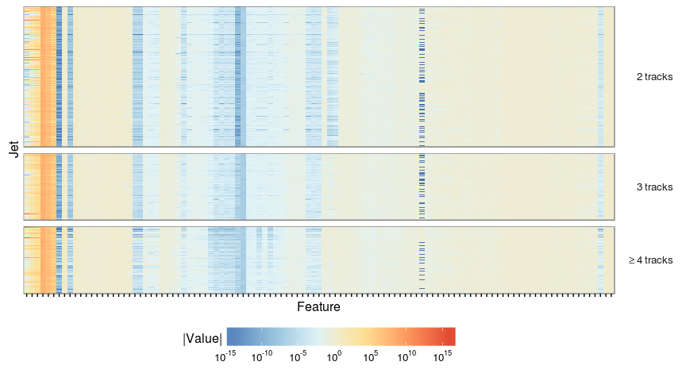

## Magnitude map

- Initially there is huge variation in magnitude among the features
- Applied Z-score standardisation so that features have mean 0 and standard deviation 1
- Additionally, applied Yeo-Johnson power transformations to make features with long-tailed distributions more Gaussian
- Examine correlations next (and discover that correlograms are rather poor visualisations for this data)

## 

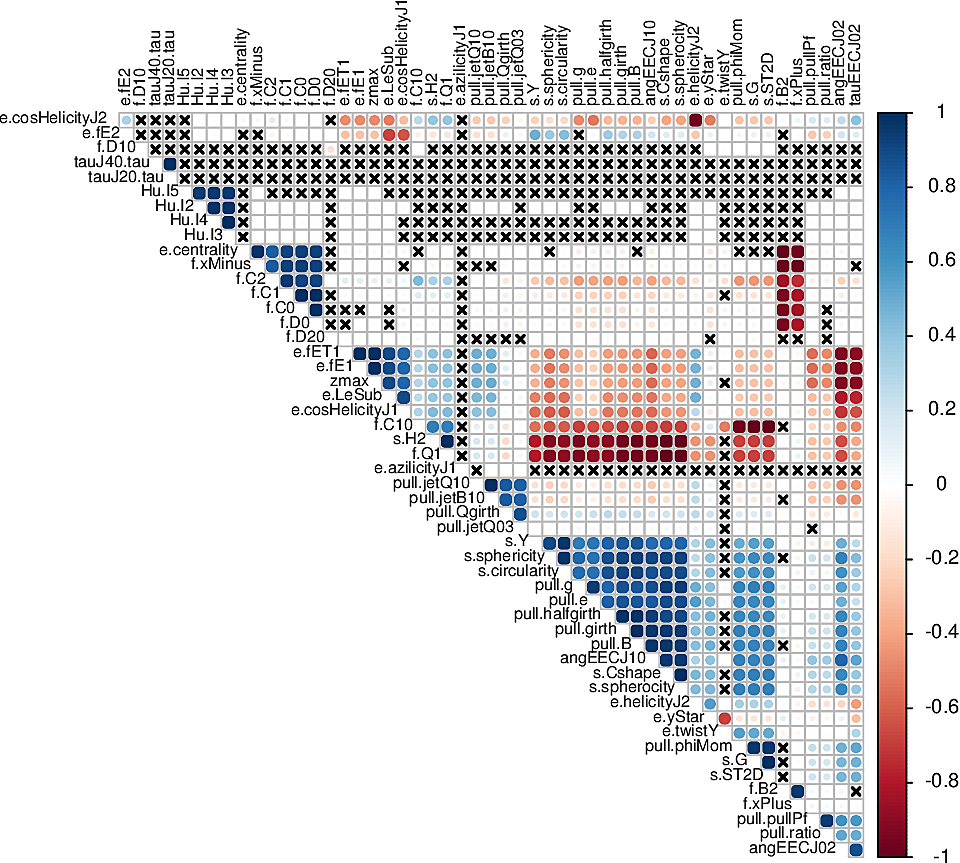


## 

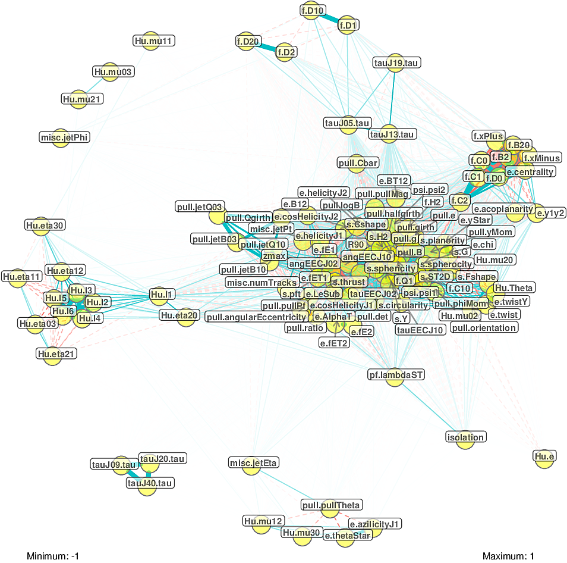


## 

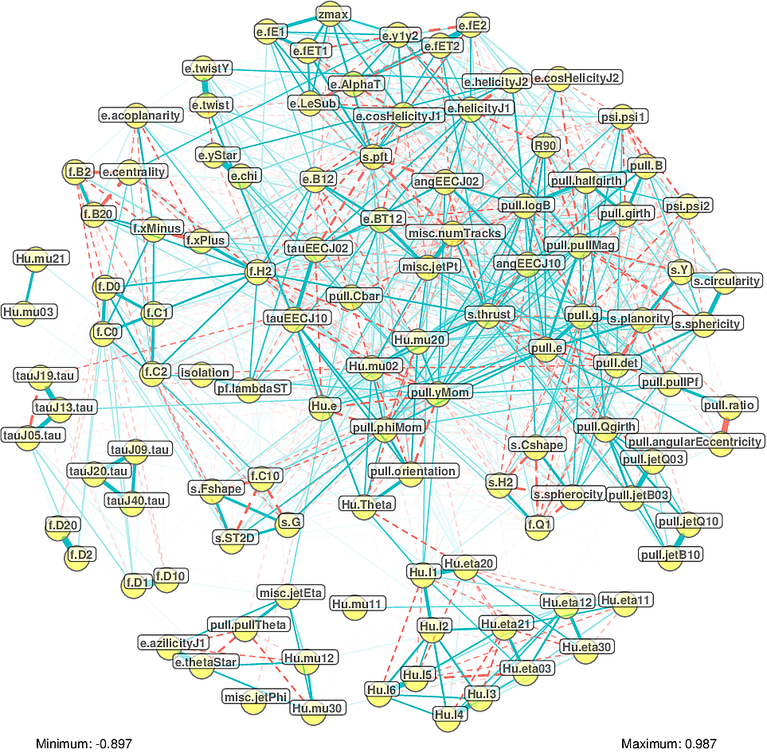


## 

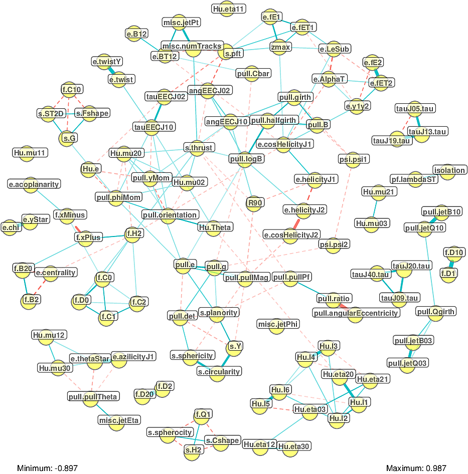


## Fast feature selection

* We want to find the variables that best explain the differences in physics between quark-jets and gluon-jets
* Typical methods for feature selection too slow
* Ranked features using an entropy-based method
* Filter-based method that involves ranking by *information gain* (Kullback–Leibler divergence)
    - Information gain is based on the concept of entropy from information theory and is commonly used to decide which features to use when growing a decision tree
* To test method: inject random probes ("BOGUS" features) into the data, repeatedly calculate information gain for a large number of bootstrap resamplings, obtain means and confidence interval estimates

## 

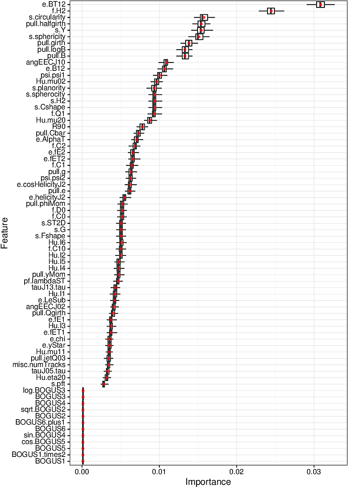

## Removing redundant features using mutual information

- Information gain does not separate redundant features
- To filter redundant features, I used *mutual information*
    * In information theory, the mutual information (MI) of two random variables is a measure of their mutual dependence
    * Quantifies the "amount of information" obtained about one random variable, through the other random variable
    * Used *symmetric uncertainty*, a normalized variant that we can treat like a correlation
    
## 

```{r mutinfo, echo = FALSE, message = FALSE, warning = FALSE, error = FALSE, fig.align='center', fig.height=4, fig.cap="Venn diagram for various information measures associated with correlated variables X and Y. The area contained by both circles is the joint entropy H(X,Y). The circle on the left (red and violet) is the individual *Shannon entropy* H(X). The circle on the right (blue and violet) is H(Y). The violet is the **mutual information** I(X;Y).", cache=TRUE}

require(png)
require(grid)
img <- readPNG("mutinfo.png")
grid.raster(img)
```

## 

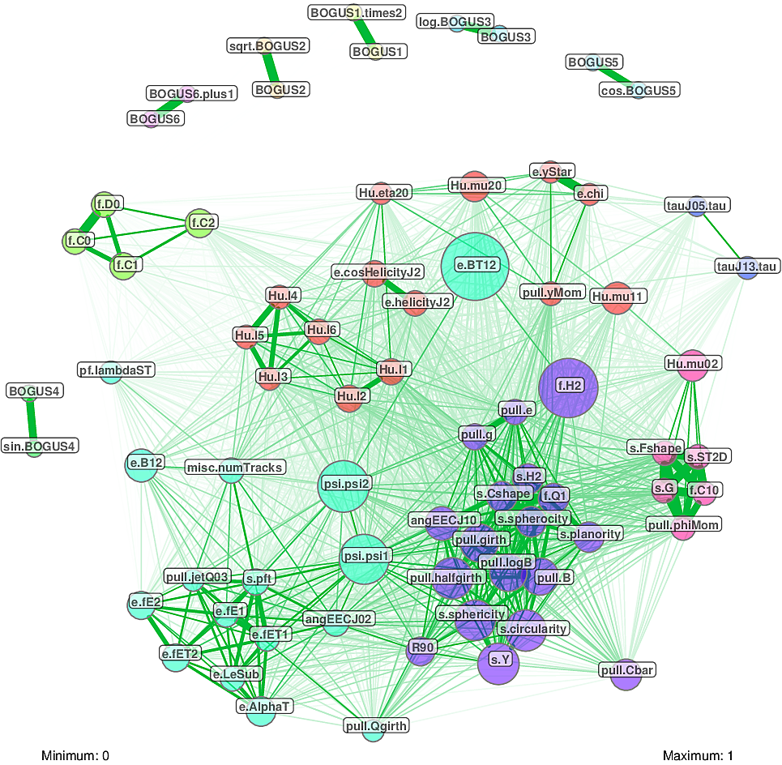


## Feature redundancy

* We'd like to pick features that have a strong association with the target ("quark"/"gluon") but have weak association with each other

```{r venn, echo = FALSE, message = FALSE, warning = FALSE, error = FALSE, fig.align='center', fig.height=4, fig.cap="<small>If Z is the target, for each X and Y measure the total *conditional mutual information* corresponding to the cyan and magenta regions. If the sum is large (and the grey region is small) then this is a good pairing. Note that the grey region (the *multivariate mutual information*) may be negative, meaning that a pair of features may synergise.</small>", cache=TRUE}

require(png)
require(grid)
img <- readPNG("venn.png")
grid.raster(img)
```

## 

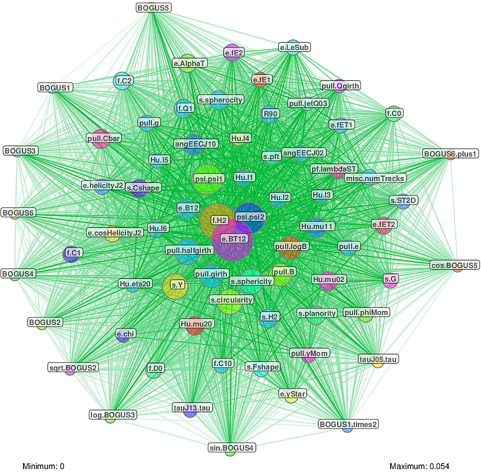


## 

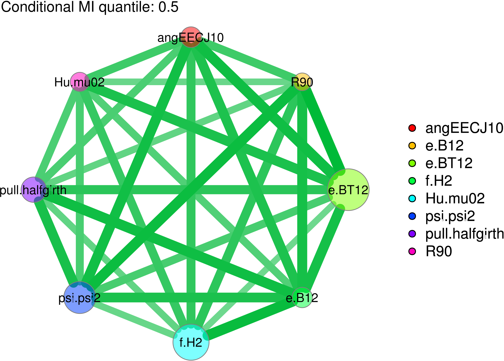


## 

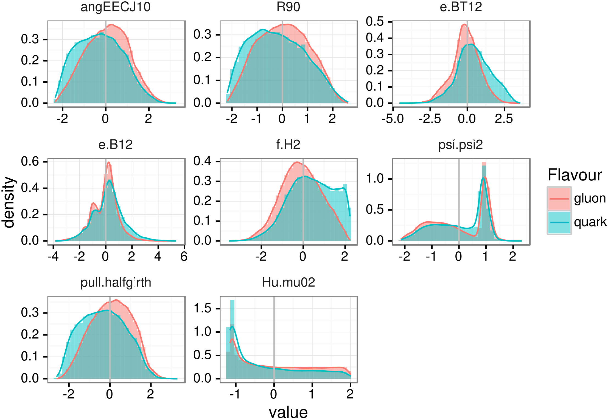


## 

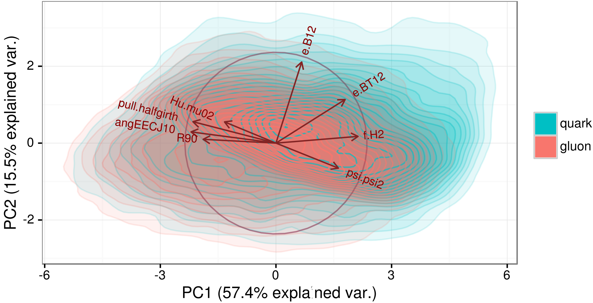

## Model

- Our baseline model is ElasticNet, a generalised linear model that combines the $\ell_1$ and $\ell_2$ penalties of the LASSO (least absolute shrinkage and selection operator) and ridge methods:
    - $\ell_1$ is a LASSO penalty
    - $\ell_2$ is a ridge penalty, aka Tikhonov regularisation
- It's basically logistic regression and fit via penalized maximum likelihood with the result that the coefficients shrink and can become zero, resulting in a sparse model
- Nested stratified k-fold cross validation was used to generate robust estimates of model performance:
    - The outer CV is used to estimate model performance; 5 folds
    - The inner CV is used for hyperparameter ($\alpha$, $\lambda$) tuning and model selection; 5 folds
- Created a custom metric to tune the probability threshold for a quark-tagging efficiency of 50%


## 

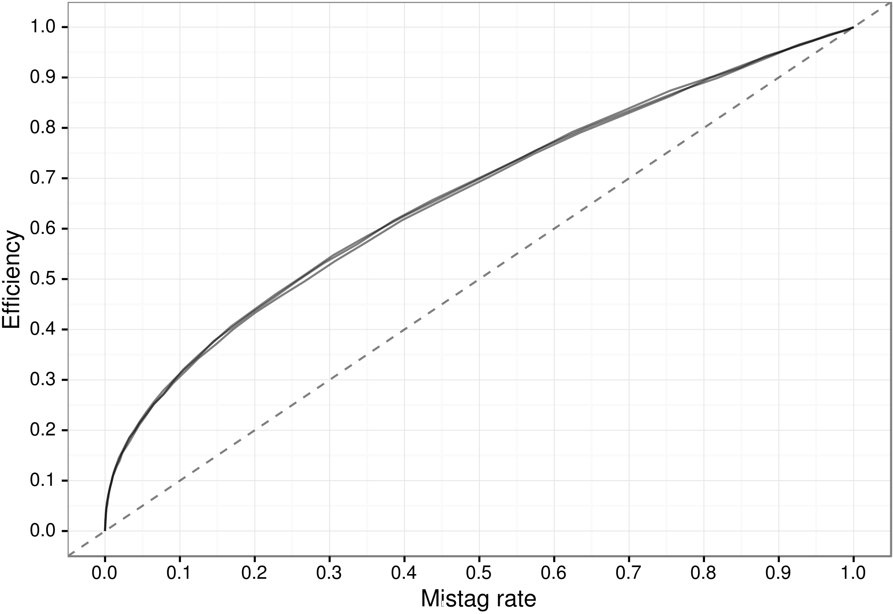

## Results

- At our chosen working point, a quark tagging efficiency of 50%, the gluon mistag rate is estimated to be 26%
- This is not bad for a simple linear model!
- The whole model can be summarised in a handful of coefficients: the means and standard deviations used to standardise the features, the Yeo-Johnson $\lambda$s used to make the feature distributions Gaussian-like, and the $\beta$s of the ElasticNet model
- Did not use PCA/ICA for the sake of interpretability
- We tried other classes of model, but none had better performance
    - ANN, BDT (AdaBoost & Real AdaBoost), GBM, SVM (various kernels), kNN, Random Forest, Rotation Forest...
- Models using boosting were consistently bad: class noise hurts!
- We found some good engineered features, but we conjecture the next leap in performance will come from neural nets that can learn their own features

## What is the best feature?

- Answer: there is no silver bullet; the performance of features appears to be dependent on upstream cuts and (we conjecture) other details of the experimental setup (*e.g.*, jet algorithm radial parameter, whether any jet topiary was performed)
- We explored feature importance, using information gain, as a function of the number of tracks per jet, and the minimum number of tracks per jet
    - We required that there are at least two tracks in a jet
    - If we increase this number, we would reject more jets, but might this be a compromise worth making? *Look in the long tail?*
- Next, we show that increasing the minimum number of tracks ought to lead to increased quark/gluon discrimination power for those jets that remain after this cut, but the relationship is not monotonic --- we conjecture that jet grooming might be useful
- Room for improvement?

## 

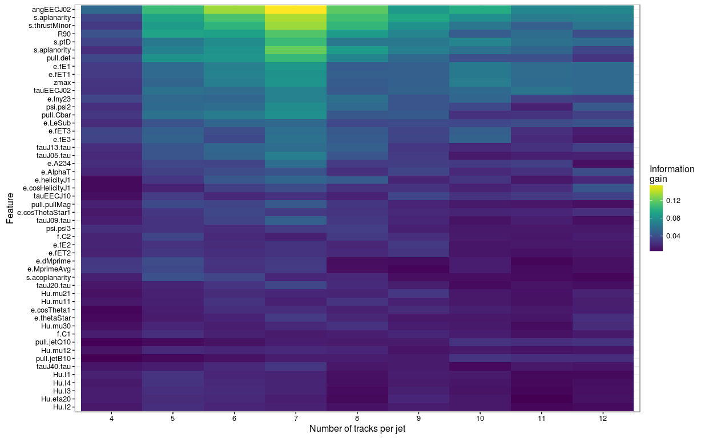

## 

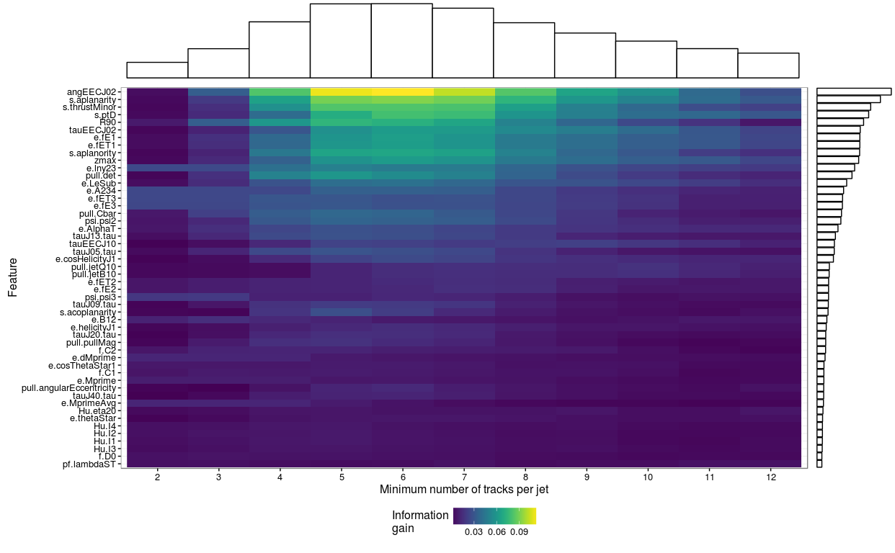


## Reproducible research

- The paper (in preparation) is written in R Markdown, a LaTeX-like authoring format that combines the core syntax of Markdown (an easy to write plain-text format) with embedded R code chunks that are run so their output can be included in the final document
- The markup for the paper contains the entire analysis code used to generate the LaTeX, tables, and plots
- Greater transparency: no need for "forensic HEP" to figure out how the results were derived from the data! 
- The pay-off in the (not so) long run is that reuse allows for de-duplication of effort
- Other researchers (you!) can easily build upon reproducible analyses to create new work or perform secondary analyses
- We should do more of this!